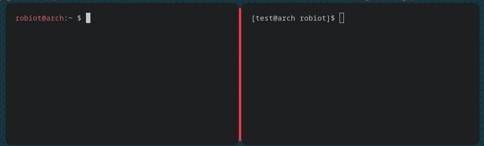
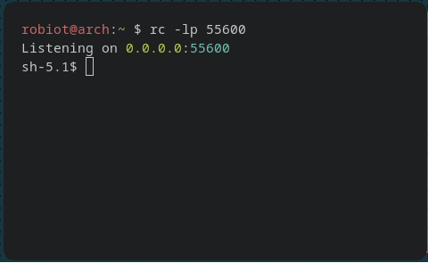

   
  
   
  
  
  
  
  
  
  
  

| 
<a href="https://crates.io/crates/rustcat">:package: Cargo</a>
            | 
<a href="https://github.com/robiot/rustcat/releases">:cyclone: Kali / Debian 
                 | 
<a href="https://aur.archlinux.org/packages/rustcat/">🏗️ Arch </a>
                       | 
<a href="https://github.com/robiot/rustcat/releases">:computer: Other </a>
                     |
| ----------------------------------------------------------------------------------------------------------------- | --------------------------------------------------------------------------------------------------------------- | --------------------------------------------------------------------------------------------------------------- | --------------------------------------------------------------------------------------------------------------- |
| 

 | 

 | 

 | 

 |
| `cargo install rustcat` | [Read the install guide](https://github.com/robiot/rustcat/wiki/Installation-Guide#kalidebian)     | `yay -S rustcat`                                                                                               |  [Read the install guide](https://github.com/robiot/rustcat/wiki/Installation-Guide#other)     

# :thinking: What Is Rustcat?

:art: Rustcat is a modern port listener & Reverse Shell that is very easy to use.

# :sparkles: Features
* Listen on ports
* Command history
* Reverse shell
* Udp
* Colors

# :gear: Why Rustcat?
Rustcat is a modern port listener that is easier to use and understand than most of the older ones on the market.

## :baby: Everything Easy

Starting a listener is just as simple as `rc -lp port`. While in netcat you would do something like `nc -nlvp port`.

And creating a reverse shell has never been easier, `rc -rp port shell` is all you need. No more long piping stdin, stdout, stderr from /dev/tcp into /bin/shell that you always forget.

## :page_with_curl: Command History

Command history is something we all need. How annoying isn't it when you accidently type a long command wrong, then you have to rewrite the entire thing.

But Rustcat fixes that with command history. Just add -H and you will get command history (`rc -lpH port`), unlike netcat where you have to use another application and do `rlwrap -cAr nc -nlvp port`.

## :art: Appearance

A little splash of color doesn't hurt :).

# :book: Full Installation Guide
You can find the guide [here](https://github.com/robiot/rustcat/wiki/Installation-Guide)

# :bulb: Usage
A basic usage guide can be found [here](https://github.com/robiot/rustcat/wiki/Basic-Usage)
